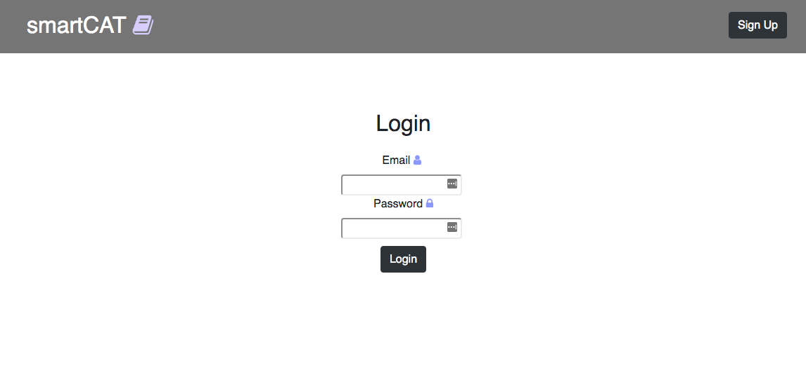
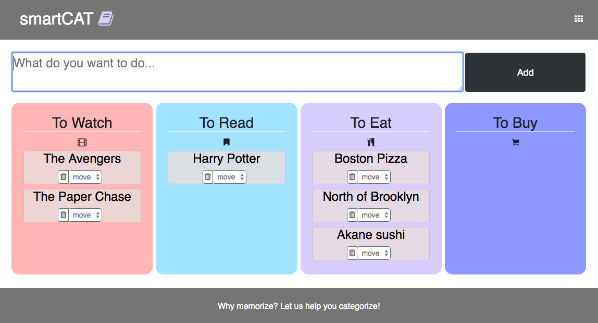

# smartCat

## Getting Started

1. Create the `.env` by using `.env.example` as a reference: `cp .env.example .env`
2. Update the .env file with your correct local information
3. Install dependencies: `npm i`
4. Fix to binaries for sass: `npm rebuild node-sass`
5. Run migrations: `npm run knex migrate:latest`
  - Check the migrations folder to see what gets created in the DB
6. Run the seed: `npm run knex seed:run`
  - Check the seeds file to see what gets seeded in the DB
7. Run the server: `npm run local`
8. Visit `http://localhost:8080/`

## Dependencies
  * Node
  * Knex
  * Express
  * Ejs
  * Cookie-Parser
  * Body-Parser
  * Pg
  * Yelp-fusion
  * String-similarity
  * Omdbapi
  * dotenv

---

## Final Project

Login Page: 

Main Page:
